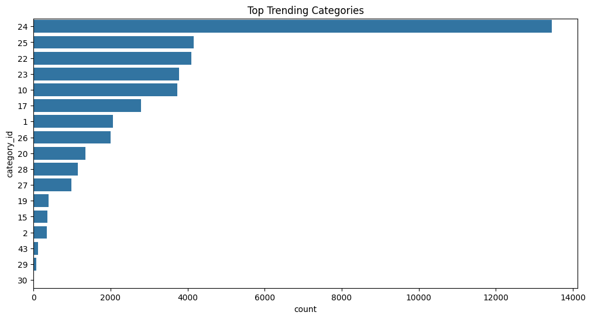
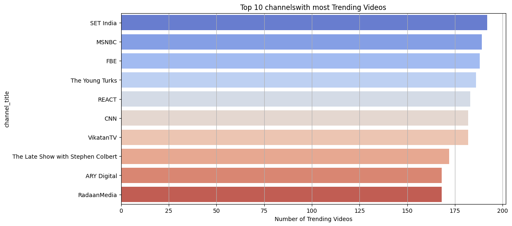
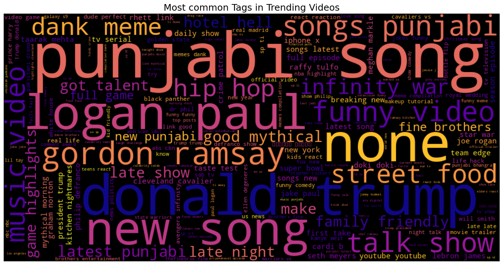
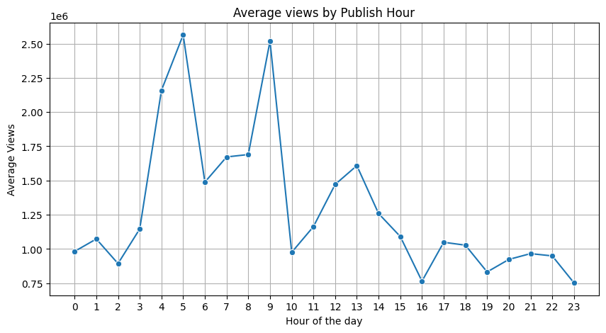
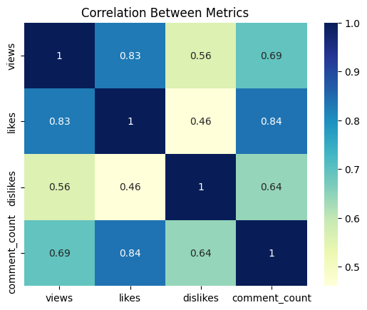
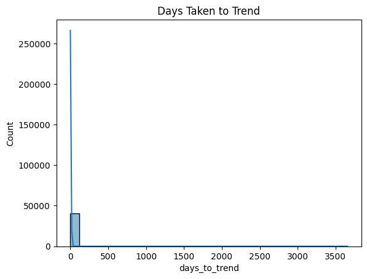
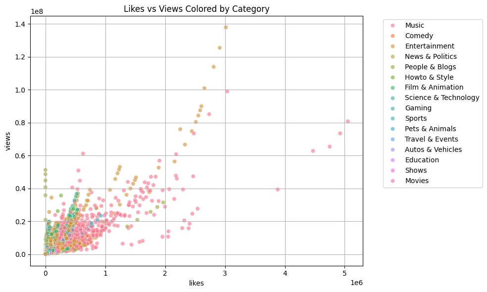
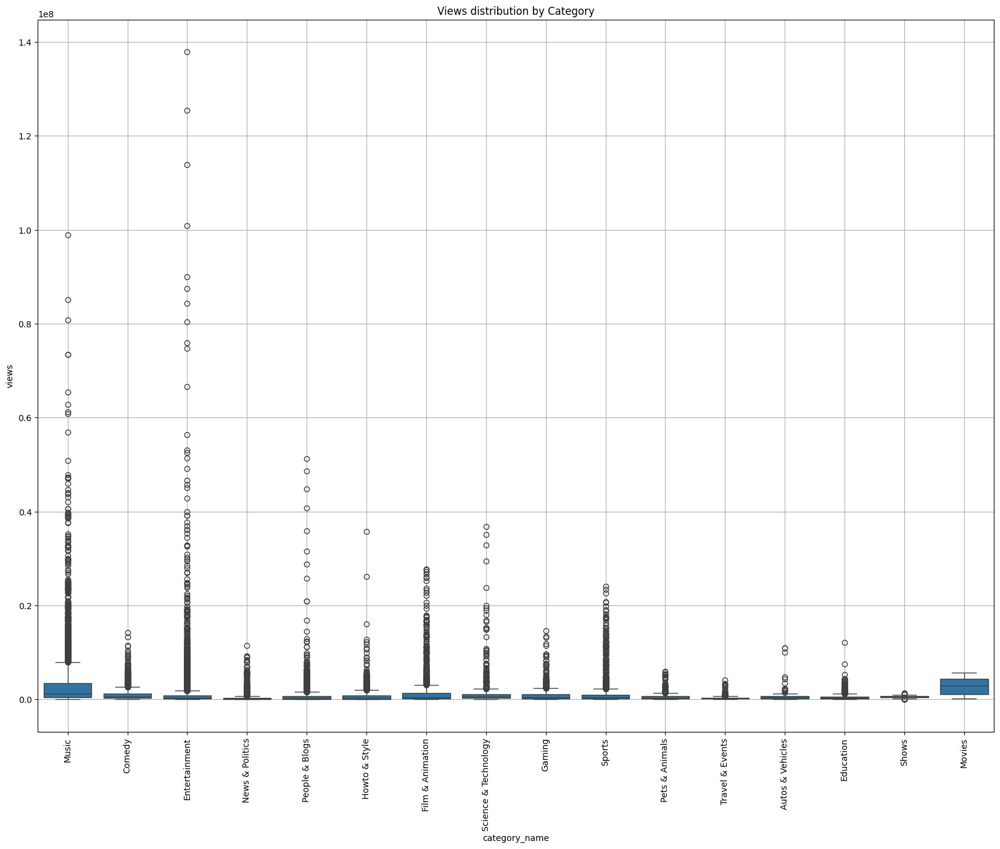

# 📊 YouTube Trending Video Analysis (🇨🇦 Canada Edition)

What makes a video go viral in Canada? This project dives into trending YouTube videos using real public data to uncover insights about views, tags, categories, timing, and more — all powered by Python & pandas.

---

## 📁 Dataset
- **Source**: [Kaggle – YouTube Trending Videos](https://www.kaggle.com/datasets/datasnaek/youtube-new)
- **File Used**: `CAvideos.csv`
- Covers thousands of trending videos in Canada with metrics like views, likes, publish time, and more.

---

## 🎯 Project Objectives

- Clean and preprocess real-world video trend data
- Engineer new features such as:
  - `days_to_trend`
  - `publish_hour`
  - `category_name` (mapped from `category_id`)
- Visualize engagement trends and video performance
- Highlight content strategy insights with clean graphs

---

## 🔧 Tech Stack

| Tool       | Usage                        |
|------------|------------------------------|
| `pandas`   | Data manipulation            |
| `matplotlib/seaborn` | Visualizations     |
| `wordcloud` | Tag frequency clouds         |
| `plotly`   | Interactive plots (optional) |
| `Jupyter`  | Development environment      |

---

## 📊 Key Visuals

### 📌 Top Trending Categories  

### 👑 Top 10 Channels with Most Trending Videos  

### ☁️ Most Common Tags in Trending Videos  

### ⏱️ Average Views by Publish Hour  

### 📈 Correlation Between Metrics  

### 🕰️ Days Taken to Trend  

### 🔥 Likes vs Views Colored by Category  

### 📦 Views Distribution by Category  

---

## 🔍 Key Insights

- **Music & Entertainment** absolutely dominate the Canadian trending space.
- Some videos trend **within 24 hours**, others take **days to catch fire**.
- **Late afternoon (3 PM to 6 PM)** appears to be the best publish window for higher views.
- **Tags like “punjabi”, “trump”, “logan paul”** appear frequently—spicy content pulls views.
- Some channels (like *Gordon Ramsay* or *Logan Paul*) repeatedly show up—trend kings.

---

## 🚀 Run It Yourself

1. Clone the repo  
2. Download `CAvideos.csv` + `CA_category_id.json` from Kaggle  
3. Place them in `/data`  
4. Run `notebooks/youtube_analysis.ipynb`  
5. Visuals will be saved in `/assets`

---

## 🛠️ Project Structure

youtube-trending-analysis/
├── data/ # Dataset (not pushed to GitHub)
├── assets/ # All generated charts
├── notebooks/
│ └── youtube_analysis.ipynb
├── README.md
├── requirements.txt
└── .gitignore

## 💡 Future Work

- 🎭 Sentiment analysis on titles/descriptions
- 🔮 Predict if a video will trend based on metadata
- 🌍 Compare across other countries (IN, US, GB...)

---

## 🧠 Author

Made with ☕ and midnight madness by **Ritesh Manandhar**  
[GitHub](https://github.com/badbytebat) • [LinkedIn](https://linkedin.com/in/ritesh-bytegenosis)
